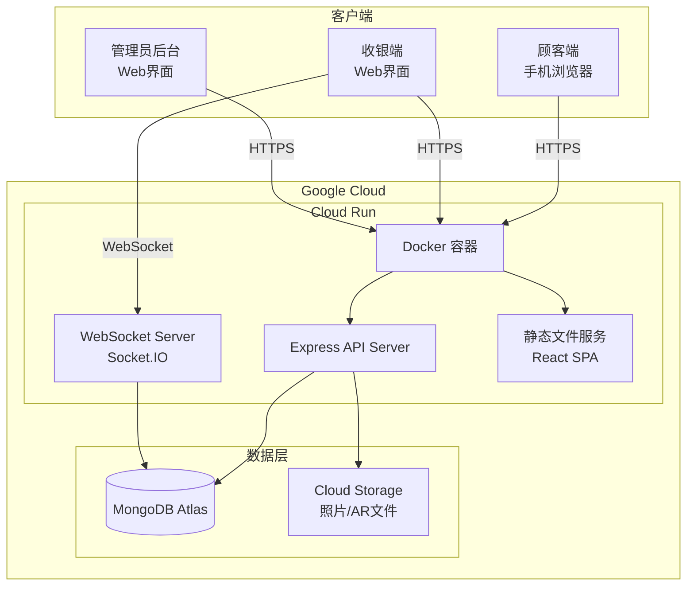
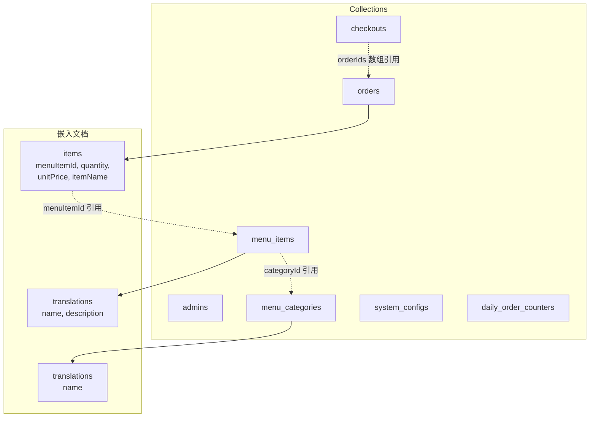

# 技术设计文档：餐馆点餐系统

## 概述

本设计文档描述一个基于Web的餐馆点餐系统的技术架构与实现方案。系统包含三个Web端：顾客端（手机浏览器扫码访问）、收银端（前台Web界面）、管理员后台（Web管理界面）。

系统核心功能包括：
- 堂食扫码点餐与外卖扫码点餐
- 收银端订单管理与结账（支持整桌/按座位结账，现金/刷卡/混合支付）
- 小票打印（通过浏览器 `window.print()` API）
- 菜单管理（分类、菜品信息、AR展示、库存/售罄管理）
- 多语言支持
- 订单历史与营业报表
- 管理员权限控制（老板/收银员角色）

技术栈选型：
- **前端**：React + TypeScript，使用 React Router 实现多端路由
- **后端**：Node.js + Express + TypeScript，RESTful API
- **数据库**：MongoDB Atlas，使用 Mongoose ODM
- **实时通信**：WebSocket（Socket.IO），用于收银端订单实时更新
- **文件存储**：本地文件系统或对象存储（菜品照片、AR文件）
- **国际化**：i18next（前端）+ 数据库多语言嵌入文档（菜品内容）
- **部署平台**：Google Cloud Run，通过项目根目录 Dockerfile 进行容器化部署
- **容器化**：Docker 多阶段构建，前后端打包为单一容器镜像

## 架构

### 系统架构图



### 架构决策

1. **单体应用架构**：系统规模适中，采用单体架构降低部署和运维复杂度。前端为SPA，后端为单一Express服务。
2. **WebSocket用于实时更新**：收银端需要实时接收新订单和订单修改通知，使用Socket.IO实现。顾客端不需要WebSocket，通过HTTP轮询或提交后刷新即可。
3. **浏览器打印方案**：小票打印使用 `window.print()` API，前端生成打印专用HTML模板，通过CSS `@media print` 控制打印样式。
4. **AR展示方案**：使用USDZ格式文件，iOS设备通过 `<a rel="ar">` 标签原生支持AR Quick Look，Android设备通过model-viewer组件支持。
5. **多语言方案**：UI文字使用i18next国际化框架，菜品内容（名称、描述）在MongoDB文档中使用嵌入式子文档存储多语言版本，无需独立的翻译集合。
6. **预留厨房端接口**：订单创建和状态变更时通过事件系统发布事件，未来厨房端可订阅这些事件。
7. **容器化单一部署**：前端构建产物由 Express 静态文件中间件托管，前后端打包为单一 Docker 容器，简化部署流程。
8. **MongoDB Atlas 数据库**：使用 MongoDB Atlas 全托管云数据库服务，通过 Mongoose ODM 进行数据建模和操作。MongoDB 的文档模型天然适合本系统中嵌套数据结构（如订单项嵌入订单、多语言翻译嵌入菜品文档），减少关联查询，提升读取性能。文件存储可使用 Cloud Storage。

### 部署架构

#### 部署平台：Google Cloud Run

系统部署在 Google Cloud Run 上，利用其全托管的无服务器容器平台特性：

- **自动扩缩容**：Cloud Run 根据请求流量自动扩缩容器实例数量，空闲时可缩至零实例以节省成本
- **HTTPS 自动配置**：Cloud Run 自动提供 HTTPS 端点，无需手动配置 TLS 证书
- **WebSocket 支持**：Cloud Run 支持 WebSocket 长连接，需配置会话亲和性（session affinity）确保 Socket.IO 连接稳定
- **环境变量注入**：数据库连接字符串、密钥等敏感配置通过 Cloud Run 环境变量或 Secret Manager 注入

#### Dockerfile 设计

项目根目录的 `/Dockerfile` 采用多阶段构建（multi-stage build），将前后端打包为单一容器镜像：

```dockerfile
# 阶段1：构建前端
FROM node:20-alpine AS frontend-build
WORKDIR /app/frontend
COPY frontend/package*.json ./
RUN npm ci
COPY frontend/ ./
RUN npm run build

# 阶段2：构建后端
FROM node:20-alpine AS backend-build
WORKDIR /app/backend
COPY backend/package*.json ./
RUN npm ci
COPY backend/ ./
RUN npm run build

# 阶段3：生产镜像
FROM node:20-alpine AS production
WORKDIR /app

# 复制后端构建产物和依赖
COPY --from=backend-build /app/backend/dist ./dist
COPY --from=backend-build /app/backend/package*.json ./
RUN npm ci --omit=dev

# 复制前端构建产物到后端静态文件目录
COPY --from=frontend-build /app/frontend/dist ./public

EXPOSE 8080
ENV NODE_ENV=production
ENV PORT=8080

CMD ["node", "dist/server.js"]
```

**设计要点**：

1. **多阶段构建**：分离构建环境和运行环境，最终镜像仅包含生产依赖，减小镜像体积
2. **前端静态托管**：React SPA 构建产物复制到 `public` 目录，由 Express 的 `express.static('public')` 中间件提供服务
3. **端口配置**：Cloud Run 默认使用 `PORT` 环境变量（默认 8080），Express 服务监听该端口
4. **Mongoose 无需代码生成**：Mongoose 的模型定义在代码中直接使用，无需额外的代码生成步骤，简化了构建流程

#### Cloud Run 部署配置要点

| 配置项 | 推荐值 | 说明 |
|-------|--------|------|
| 最小实例数 | 1 | 避免冷启动延迟，保证收银端响应速度 |
| 最大实例数 | 10 | 根据餐厅规模调整，防止突发流量导致成本失控 |
| 内存 | 512Mi | 满足 Node.js + Mongoose 运行需求 |
| CPU | 1 | 单核足以应对中小型餐厅并发 |
| 请求超时 | 300s | 为 WebSocket 长连接和文件上传预留足够时间 |
| 会话亲和性 | 启用 | 确保 Socket.IO WebSocket 连接路由到同一实例 |
| 并发请求数 | 80 | 每个实例最大并发请求数 |

#### 数据库连接

- 使用 MongoDB Atlas 全托管云数据库，通过标准连接字符串直接连接，无需额外的代理或连接器
- 连接字符串通过环境变量 `DBCON` 注入，格式：`mongodb+srv://[username]:[password]@[host]/?appName=[appName]`
- Mongoose 在应用启动时通过 `mongoose.connect(process.env.DBCON)` 建立连接，自动管理连接池

```typescript
// 数据库连接示例
import mongoose from 'mongoose';

async function connectDB() {
  const dbUri = process.env.DBCON;
  if (!dbUri) {
    throw new Error('环境变量 DBCON 未设置');
  }
  await mongoose.connect(dbUri);
  console.log('MongoDB Atlas 连接成功');
}
```

#### 部署流程


## 组件与接口

### 前端组件

#### 顾客端（Customer Web App）

| 组件 | 职责 |
|------|------|
| `ScanLanding` | 扫码着陆页，解析QR码参数（桌号/座位号或外卖标识） |
| `MenuView` | 菜单展示，按分类显示菜品列表，支持语言切换 |
| `MenuItemCard` | 单个菜品卡片，显示照片、名称、价格、热量、等待时间、AR图标 |
| `ARViewer` | AR展示组件，长按触发USDZ文件加载 |
| `Cart` | 购物车，管理已选菜品和数量 |
| `OrderSubmit` | 订单提交，显示订单摘要并确认下单 |
| `OrderStatus` | 订单状态页，显示订单信息和结账提示 |
| `LanguageSwitcher` | 语言切换组件 |

#### 收银端（Cashier Web App）

| 组件 | 职责 |
|------|------|
| `DineInOrderBoard` | 堂食订单看板，按桌号分组显示未结账订单 |
| `TakeoutOrderList` | 外卖订单列表，按每日单号排序 |
| `OrderDetail` | 订单详情，显示座位级菜品明细 |
| `CheckoutFlow` | 结账流程，支持整桌/按座位结账 |
| `PaymentForm` | 支付表单，支持现金/刷卡/混合支付 |
| `OrderEditor` | 结账中订单修改，增减菜品并实时重算金额 |
| `ReceiptPrint` | 小票打印组件，生成打印HTML并调用 `window.print()` |
| `TakeoutDelivery` | 外卖交付管理，显示未取餐订单并支持标记完成 |

#### 管理员后台（Admin Web App）

| 组件 | 职责 |
|------|------|
| `CategoryManager` | 菜品分类管理（CRUD、排序） |
| `MenuItemManager` | 菜品信息管理（CRUD、照片上传、AR文件上传） |
| `InventoryManager` | 库存/售罄状态管理 |
| `I18nEditor` | 多语言内容编辑 |
| `OrderHistory` | 订单历史查询 |
| `ReportDashboard` | 营业报表展示 |
| `UserManager` | 管理员账号与权限管理 |
| `SystemConfig` | 系统配置（小票打印份数等） |

### 后端API接口

#### 菜单相关

```
GET    /api/menu/categories          获取所有分类（支持?lang参数）
POST   /api/menu/categories          创建分类
PUT    /api/menu/categories/:id      更新分类
DELETE /api/menu/categories/:id      删除分类（检查关联菜品）

GET    /api/menu/items               获取所有菜品（支持?lang&category参数）
POST   /api/menu/items               创建菜品
PUT    /api/menu/items/:id           更新菜品信息
DELETE /api/menu/items/:id           删除菜品
POST   /api/menu/items/:id/photo     上传菜品照片
POST   /api/menu/items/:id/ar        上传AR文件（USDZ）
PUT    /api/menu/items/:id/sold-out  更新售罄状态
```

#### 订单相关

```
POST   /api/orders                   创建订单（堂食/外卖）
GET    /api/orders/:id               获取订单详情
PUT    /api/orders/:id/items         修改订单菜品（增减）
GET    /api/orders/dine-in           获取未结账堂食订单（按桌号分组）
GET    /api/orders/takeout           获取未结账外卖订单
GET    /api/orders/takeout/pending   获取已结账未取餐外卖订单
PUT    /api/orders/takeout/:id/complete  标记外卖订单已完成
```

#### 结账相关

```
POST   /api/checkout/table/:tableNumber       整桌结账
POST   /api/checkout/seat/:orderId            按座位结账
GET    /api/checkout/receipt/:checkoutId       获取小票数据
```

#### 报表相关

```
GET    /api/reports/orders           订单历史查询（支持日期范围、类型筛选）
GET    /api/reports/summary          营业报表统计
```

#### 管理相关

```
POST   /api/auth/login               管理员登录
GET    /api/admin/users              获取管理员列表
POST   /api/admin/users              创建管理员
PUT    /api/admin/users/:id          更新管理员信息
DELETE /api/admin/users/:id          删除管理员
GET    /api/admin/config             获取系统配置
PUT    /api/admin/config             更新系统配置
```

### WebSocket事件

```
服务端 -> 收银端:
  order:new           新订单通知
  order:updated       订单修改通知
  order:checked-out   订单结账通知

预留（厨房端）:
  kitchen:new-order   新订单推送
  kitchen:order-update 订单变更推送
```

### 权限中间件

```typescript
// 角色定义
enum Role {
  OWNER = 'owner',
  CASHIER = 'cashier'
}

// 权限映射
const permissions = {
  [Role.OWNER]: ['menu:*', 'order:*', 'checkout:*', 'report:*', 'admin:*', 'config:*'],
  [Role.CASHIER]: ['order:read', 'checkout:*', 'receipt:print', 'takeout:complete']
}

// 中间件：requirePermission('menu:write')
```


## 数据模型

### MongoDB 文档模型设计

本系统使用 MongoDB 文档模型，充分利用嵌入式子文档（embedded documents）减少关联查询。以下为各集合（Collection）的 Mongoose Schema 设计。

#### 设计原则

- **多语言翻译嵌入文档**：菜品分类和菜品的多语言翻译直接嵌入到父文档中，作为 `translations` 数组，无需独立的翻译集合
- **订单项嵌入订单**：`ORDER_ITEM` 作为嵌入子文档存储在 `ORDER` 文档内，一次查询即可获取完整订单信息
- **结账关联使用数组引用**：`CHECKOUT` 文档中使用 `orderIds` 数组引用关联的订单
- **适当引用关系**：菜品引用分类ID（`categoryId`），保持数据一致性

#### 集合结构图



#### admins 集合

```typescript
const AdminSchema = new mongoose.Schema({
  username: { type: String, required: true, unique: true },
  passwordHash: { type: String, required: true },
  role: { type: String, enum: ['owner', 'cashier'], required: true },
}, { timestamps: true });
```

#### menu_categories 集合

```typescript
const CategoryTranslationSchema = new mongoose.Schema({
  locale: { type: String, required: true },   // 如 'zh-CN', 'en-US'
  name: { type: String, required: true },
}, { _id: false });

const MenuCategorySchema = new mongoose.Schema({
  sortOrder: { type: Number, required: true },
  translations: [CategoryTranslationSchema],
}, { timestamps: true });
```

#### menu_items 集合

```typescript
const ItemTranslationSchema = new mongoose.Schema({
  locale: { type: String, required: true },
  name: { type: String, required: true },
  description: { type: String, default: '' },
}, { _id: false });

const MenuItemSchema = new mongoose.Schema({
  categoryId: { type: mongoose.Schema.Types.ObjectId, ref: 'MenuCategory', required: true },
  price: { type: Number, required: true },
  calories: { type: Number },
  avgWaitMinutes: { type: Number },
  photoUrl: { type: String },
  arFileUrl: { type: String },
  isSoldOut: { type: Boolean, default: false },
  translations: [ItemTranslationSchema],
}, { timestamps: true });
```

#### orders 集合

```typescript
const OrderItemSubdocSchema = new mongoose.Schema({
  menuItemId: { type: mongoose.Schema.Types.ObjectId, ref: 'MenuItem', required: true },
  quantity: { type: Number, required: true, min: 1 },
  unitPrice: { type: Number, required: true },   // 下单时价格快照
  itemName: { type: String, required: true },     // 下单时名称快照
}, { _id: true });

const OrderSchema = new mongoose.Schema({
  type: { type: String, enum: ['dine_in', 'takeout'], required: true },
  tableNumber: { type: Number },       // 堂食用，nullable
  seatNumber: { type: Number },        // 堂食用，nullable
  dailyOrderNumber: { type: Number },  // 外卖用，nullable
  status: { type: String, enum: ['pending', 'checked_out', 'completed'], default: 'pending' },
  items: [OrderItemSubdocSchema],
}, { timestamps: true });
```

#### checkouts 集合

```typescript
const CheckoutSchema = new mongoose.Schema({
  type: { type: String, enum: ['table', 'seat'], required: true },
  tableNumber: { type: Number },
  totalAmount: { type: Number, required: true },
  paymentMethod: { type: String, enum: ['cash', 'card', 'mixed'], required: true },
  cashAmount: { type: Number },    // nullable
  cardAmount: { type: Number },    // nullable
  orderIds: [{ type: mongoose.Schema.Types.ObjectId, ref: 'Order' }],
  checkedOutAt: { type: Date, default: Date.now },
});
```

#### system_configs 集合

```typescript
const SystemConfigSchema = new mongoose.Schema({
  key: { type: String, required: true, unique: true },
  value: { type: String, required: true },
}, { timestamps: true });
```

#### daily_order_counters 集合

```typescript
const DailyOrderCounterSchema = new mongoose.Schema({
  date: { type: String, required: true, unique: true },  // 格式: 'YYYY-MM-DD'
  currentNumber: { type: Number, default: 0 },
});
```

### 关键数据模型说明

**订单（Order）**：
- 堂食订单关联 `tableNumber` 和 `seatNumber`，外卖订单关联 `dailyOrderNumber`
- 状态流转：`pending`（待结账）→ `checked_out`（已结账）→ `completed`（已完成，仅外卖）
- `items` 嵌入子文档中保存下单时的价格和名称快照，避免菜品信息变更影响历史订单
- 订单项直接嵌入订单文档，一次查询即可获取完整订单信息，无需关联查询

**结账（Checkout）**：
- 整桌结账时，一个 `Checkout` 文档的 `orderIds` 数组包含该桌所有订单的引用
- 按座位结账时，每个座位的订单对应一个独立的 `Checkout` 文档
- 混合支付时，`cashAmount + cardAmount = totalAmount`

**每日单号计数器（DailyOrderCounter）**：
- 以日期字符串（`YYYY-MM-DD`）为唯一键，`currentNumber` 记录当日已分配的最大单号
- 新外卖订单创建时，使用 MongoDB 的 `findOneAndUpdate` 原子操作递增 `currentNumber` 并返回新单号：

```typescript
const counter = await DailyOrderCounter.findOneAndUpdate(
  { date: todayStr },
  { $inc: { currentNumber: 1 } },
  { upsert: true, returnDocument: 'after' }
);
const dailyOrderNumber = counter.currentNumber;
```

- 使用 `upsert: true` 确保新的一天自动创建记录，`currentNumber` 从1开始
- `findOneAndUpdate` 是原子操作，天然保证并发安全，无需额外的事务或锁机制

**多语言（I18N）**：
- 菜品分类和菜品信息的多语言内容作为 `translations` 嵌入子文档数组存储在父文档中
- 每条翻译记录包含 `locale`（如 `zh-CN`、`en-US`）和对应语言的文本
- 查询时可通过 MongoDB 的 `$elemMatch` 或聚合管道按 `locale` 筛选，前端根据用户选择的语言请求对应内容
- 嵌入式设计避免了关联查询，一次读取即可获取所有语言版本

**系统配置（SystemConfig）**：
- 键值对存储，如 `receipt_print_copies`（小票打印份数）
- 管理员后台可修改，收银端结账时读取最新配置


## 正确性属性

*属性（Property）是指在系统所有有效执行中都应成立的特征或行为——本质上是对系统应做什么的形式化陈述。属性是连接人类可读规格说明与机器可验证正确性保证之间的桥梁。*

### Property 1: QR码参数解析正确性

*For any* 有效的桌号和座位号组合编码到QR码URL中，解析函数应正确提取出原始的桌号和座位号，即 `parse(encode(tableNumber, seatNumber)) === { tableNumber, seatNumber }`。

**Validates: Requirements 1.1**

### Property 2: 堂食订单创建数据完整性

*For any* 有效的菜品选择列表（菜品ID和数量的组合）以及有效的桌号和座位号，创建的堂食订单应包含所有选择的菜品、正确的数量、以及正确关联的桌号和座位号。

**Validates: Requirements 1.2**

### Property 3: 订单可修改性由状态决定

*For any* 订单和任意修改操作（增加、减少、删除菜品），当订单状态为 `pending` 时修改应成功且订单内容正确更新，当订单状态为 `checked_out` 或 `completed` 时修改应被拒绝且订单保持不变。

**Validates: Requirements 2.1, 2.3**

### Property 4: 堂食订单按桌号分组查询正确性

*For any* 一组堂食订单（不同桌号、不同座位号、不同状态），按桌号分组查询未结账订单时，返回结果应只包含 `pending` 状态的订单，且每个桌号下包含该桌所有座位的完整订单明细。

**Validates: Requirements 3.1, 3.3**

### Property 5: 整桌结账金额汇总正确性

*For any* 一桌的多个座位订单，整桌结账的总金额应等于该桌所有座位订单中各菜品（单价 × 数量）之和。

**Validates: Requirements 4.1**

### Property 6: 按座位结账独立性

*For any* 一桌的多个座位订单，按座位结账时应为每个有订单的座位生成独立的结账记录，且每个结账记录的金额等于该座位订单中各菜品（单价 × 数量）之和。

**Validates: Requirements 4.2**

### Property 7: 混合支付金额约束

*For any* 混合支付请求，系统应接受当且仅当 `cashAmount + cardAmount === totalAmount` 的支付，拒绝两者之和不等于总额的支付请求。

**Validates: Requirements 4.4**

### Property 8: 结账后订单状态流转

*For any* 一组处于 `pending` 状态的订单，执行结账操作后，所有关联订单的状态应变为 `checked_out`。

**Validates: Requirements 4.5**

### Property 9: 订单金额计算不变量

*For any* 订单及其菜品列表，订单总金额应始终等于所有订单项（单价 × 数量）之和。在增加或减少菜品后，重新计算的总金额应满足同样的不变量。

**Validates: Requirements 5.2**

### Property 10: 小票内容完整性

*For any* 已结账订单（堂食或外卖），生成的小票数据应包含该订单类型所需的所有字段：堂食小票包含订单编号、桌号、菜品明细、各项金额、支付方式、结账时间；外卖小票包含每日单号、菜品明细、各项金额、支付方式、结账时间。

**Validates: Requirements 6.2, 12.4**

### Property 11: 分类删除保护

*For any* 菜品分类，当该分类下存在关联菜品时删除操作应被拒绝，当该分类下无关联菜品时删除操作应成功。

**Validates: Requirements 7.3**

### Property 12: 菜单数据持久化往返

*For any* 有效的菜品分类数据或菜品信息数据，创建后再读取应返回等价的数据（名称、描述、价格、热量、等待时间、分类等字段一致）。

**Validates: Requirements 7.1, 8.1**

### Property 13: AR文件格式验证

*For any* 上传的文件，系统应仅接受USDZ格式的AR文件，拒绝其他格式的文件上传。

**Validates: Requirements 9.1**

### Property 14: AR可用状态标记

*For any* 菜品，当其关联了AR文件（`arFileUrl` 非空）时API应标记AR可用，当未关联AR文件时应标记AR不可用。

**Validates: Requirements 9.2**

### Property 15: 售罄菜品不可加入订单

*For any* 订单创建请求，如果请求中包含任何已标记为售罄的菜品，系统应拒绝该订单或拒绝包含售罄菜品的项目。

**Validates: Requirements 10.2**

### Property 16: 外卖每日单号递增与重置

*For any* 同一天内创建的外卖订单序列，分配的每日单号应严格递增且无重复；跨天后第一个外卖订单的每日单号应为1。

**Validates: Requirements 11.2, 11.3**

### Property 17: 外卖订单按单号排序

*For any* 一组未结账外卖订单，查询结果应按每日单号升序排列。

**Validates: Requirements 12.1**

### Property 18: 外卖未取餐列表正确性

*For any* 一组外卖订单（不同状态），未取餐列表应恰好包含状态为 `checked_out` 的外卖订单，不包含 `pending` 或 `completed` 状态的订单。标记某订单为完成后，该订单应从未取餐列表中消失。

**Validates: Requirements 13.1, 13.2**

### Property 19: 多语言查询正确性

*For any* 菜品及其多语言翻译数据（嵌入式 translations 子文档），按不同 `locale` 参数查询时，返回的菜品名称和描述应为对应语言版本的内容。

**Validates: Requirements 14.2**

### Property 20: 订单历史筛选正确性

*For any* 一组已结账订单和任意筛选条件（日期范围、订单类型），查询返回的每笔订单都应满足所有筛选条件，且不遗漏满足条件的订单。

**Validates: Requirements 15.1**

### Property 21: 营业报表统计正确性

*For any* 指定日期范围内的一组已结账订单，报表中的总营业额应等于所有订单金额之和，订单数量应等于订单总数，各支付方式（现金、刷卡、混合）的金额统计应分别正确。

**Validates: Requirements 15.2**

### Property 22: 权限控制正确性

*For any* 管理员角色（老板或收银员）和任意受保护的API端点，系统应当且仅当该角色拥有对应权限时允许访问，否则拒绝访问并返回权限不足的错误。老板角色应能访问所有端点，收银员角色仅能访问收银相关端点。

**Validates: Requirements 16.2, 16.3, 16.4**


## 错误处理

### API错误响应格式

所有API错误使用统一的JSON响应格式：

```json
{
  "error": {
    "code": "VALIDATION_ERROR",
    "message": "人类可读的错误描述",
    "details": {}
  }
}
```

### 错误分类与处理策略

| 错误类型 | HTTP状态码 | 错误码 | 处理策略 |
|---------|-----------|--------|---------|
| 请求参数验证失败 | 400 | `VALIDATION_ERROR` | 返回具体的字段验证错误信息 |
| 未认证 | 401 | `UNAUTHORIZED` | 重定向到登录页 |
| 权限不足 | 403 | `FORBIDDEN` | 显示权限不足提示 |
| 资源不存在 | 404 | `NOT_FOUND` | 显示资源不存在提示 |
| 业务规则冲突 | 409 | `CONFLICT` | 返回具体冲突原因 |
| 服务器内部错误 | 500 | `INTERNAL_ERROR` | 记录日志，返回通用错误提示 |

### 关键业务错误场景

1. **售罄菜品加入订单**：返回 409，错误码 `ITEM_SOLD_OUT`，包含售罄菜品ID列表
2. **已结账订单修改**：返回 409，错误码 `ORDER_NOT_MODIFIABLE`，包含当前订单状态
3. **混合支付金额不匹配**：返回 400，错误码 `PAYMENT_AMOUNT_MISMATCH`，包含期望总额和实际总额
4. **删除含菜品的分类**：返回 409，错误码 `CATEGORY_HAS_ITEMS`，包含关联菜品数量
5. **AR文件格式错误**：返回 400，错误码 `INVALID_FILE_FORMAT`，提示仅支持USDZ格式
6. **每日单号并发冲突**：使用 MongoDB `findOneAndUpdate` 原子操作保证并发安全，无需额外重试机制
7. **MongoDB 连接失败**：应用启动时检测连接状态，连接失败时记录错误日志并退出进程，由 Cloud Run 自动重启

### 前端错误处理

- 网络错误：显示重试提示，支持自动重试
- 表单验证错误：在对应字段旁显示错误信息
- 业务错误：使用Toast通知显示错误消息
- WebSocket断连：自动重连，重连后刷新数据

## 测试策略

### 双重测试方法

本系统采用单元测试与属性测试相结合的双重测试策略：

- **单元测试（Example-based）**：验证具体场景、边界条件和错误处理
- **属性测试（Property-based）**：验证跨所有输入的通用属性，确保业务逻辑的普遍正确性

### 属性测试配置

- **测试框架**：Jest + fast-check（TypeScript属性测试库）
- **最小迭代次数**：每个属性测试至少100次迭代
- **标签格式**：`Feature: restaurant-ordering-system, Property {number}: {property_text}`

### 属性测试覆盖

以下正确性属性将实现为属性测试：

| 属性编号 | 属性名称 | 测试目标 |
|---------|---------|---------|
| Property 1 | QR码参数解析 | QR码URL编码/解码往返 |
| Property 2 | 订单创建完整性 | 订单创建逻辑 |
| Property 3 | 订单可修改性 | 订单状态与修改权限 |
| Property 4 | 按桌号分组查询 | 订单查询与筛选 |
| Property 5 | 整桌结账金额 | 金额汇总计算 |
| Property 6 | 按座位结账 | 独立账单生成 |
| Property 7 | 混合支付验证 | 支付金额约束 |
| Property 8 | 结账状态流转 | 订单状态管理 |
| Property 9 | 金额计算不变量 | 订单金额计算 |
| Property 10 | 小票内容完整性 | 小票数据生成 |
| Property 11 | 分类删除保护 | 分类删除逻辑 |
| Property 12 | 菜单数据往返 | 数据持久化 |
| Property 13 | AR文件格式验证 | 文件上传验证 |
| Property 14 | AR可用状态标记 | 菜品AR状态 |
| Property 15 | 售罄不可点餐 | 库存约束 |
| Property 16 | 每日单号递增重置 | 外卖单号逻辑 |
| Property 17 | 外卖订单排序 | 查询排序 |
| Property 18 | 未取餐列表 | 外卖交付状态 |
| Property 19 | 多语言查询 | 国际化逻辑 |
| Property 20 | 历史筛选 | 订单查询筛选 |
| Property 21 | 报表统计 | 统计计算 |
| Property 22 | 权限控制 | 角色权限验证 |

### 单元测试覆盖

以下场景使用示例测试（example-based tests）：

- 堂食订单创建成功后返回结账提示（需求1.3）
- 三种支付方式分别结账成功（需求4.3、12.2）
- 结账中修改订单的具体流程（需求5.1）
- 修改打印份数配置后生效（需求6.3）
- 菜品售罄标记和恢复（需求10.1、10.3）
- 外卖QR码扫码显示菜单（需求11.1）
- 外卖订单创建后返回单号和提示（需求11.4）
- 标记外卖完成记录时间（需求13.3）
- 管理员设置多语言内容（需求14.3）
- 未授权访问返回403和提示信息（需求16.5）

### 集成测试覆盖

以下场景使用集成测试：

- WebSocket实时通知（订单创建、修改、结账通知收银端）（需求2.2、3.2、5.3）
- 菜品信息更新后顾客端同步（需求7.2、8.3）
- 文件上传（照片、AR文件）（需求8.2）
- 浏览器打印API调用（需求6.1、6.4、12.3）
- AR功能调用（需求9.3）
- MongoDB Atlas 连接与数据读写（端到端验证）

### 冒烟测试

- 系统支持至少两种语言配置（需求14.1）
- 系统支持owner和cashier两种角色（需求16.1）
